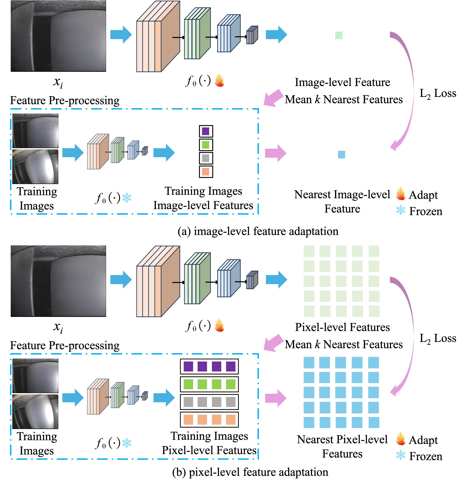

# Class-Agnostic Adaptive Feature Adaptation Method for Anomaly Detection of Aero-engine Blade

  

  

We propose a simple class-agnostic feature adaptation method to solve the problem that the previous anomaly detection feature adaptation methods are limited by the category of normal data. Our method can adapt the pre-trained features to bridge the domain gap.

## Aero-engine Blade Dataset

  

We open-source an aero-engine blade dataset, including blade borescope inspection images of multiple aero-engines. The link is [here](https://drive.google.com/file/d/1rBn7f2uFC9hwqB7XQ8zT6E7rm__O7u5z/view?usp=sharing).

## Code

We will relase the code soon.
